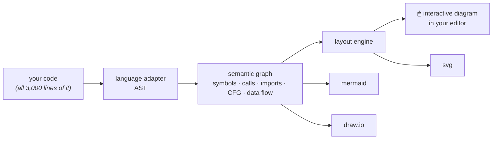
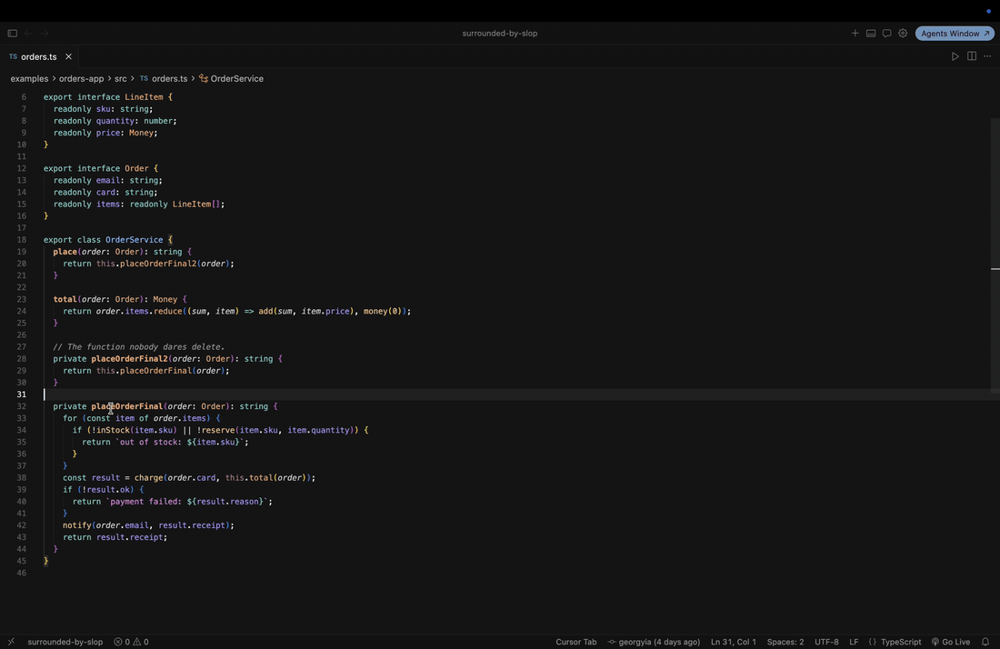
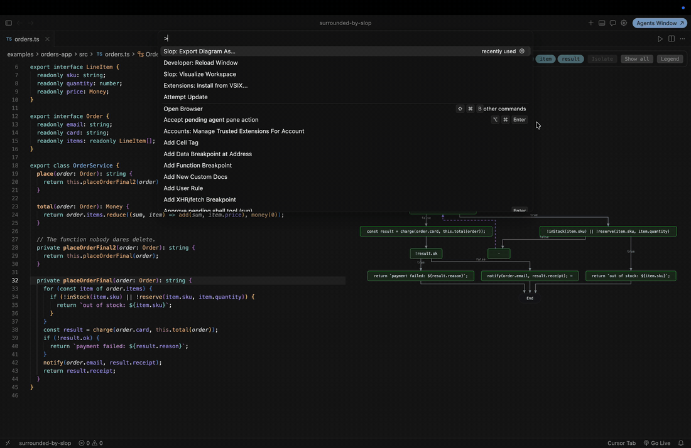
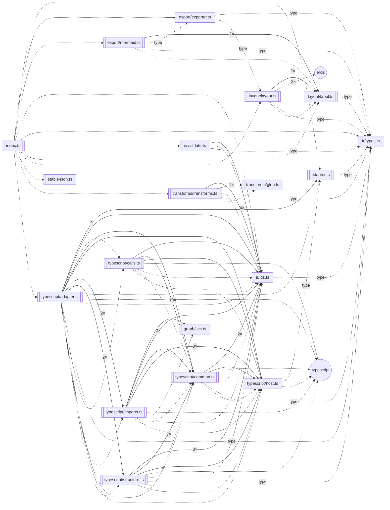

<div align="center">



<br>

[](https://github.com/georgyia/surrounded-by-slop/actions/workflows/ci.yml)
[](LICENSE)
[](CONTRIBUTING.md)
[](#faq)

**You can't understand people.** Fine — there's a bestseller for that.
**You can't understand your codebase.** That one's on us.

</div>

---

## The situation

Somewhere around 2023, code stopped being *written* and started being *generated*. You "wrote" three thousand lines last week and read maybe forty of them. Your PR was approved by a reviewer whose reviewing strategy was also a language model. Somewhere in there, `processDataFinal2()` calls `processDataFinal()`, and the only entity that knows why is a GPU in Virginia.

The book was right about one thing: you're not surrounded by idiots — you just can't decode how others think. Same energy here. **You're not a bad engineer. You're surrounded by slop.** And nobody has ever decoded slop by reading it line by line.

## The fix

Stop reading code. **Look at it.**

**surrounded-by-slop** is a VS Code / Cursor extension that turns code into diagrams, automatically:



Open a file — get its structure and call graph as an interactive diagram. Click a node — land on the exact line. Zoom out — see the whole workspace as a map instead of a folder tree you keep pretending to understand. Export to **draw.io**, **Mermaid**, or **SVG** and paste it into the PR description that nobody was going to read either.

## See it move

Open a file, get its map, visualize the whole workspace — every box jumps to its source line ([demo repo](examples/orders-app), MIT like everything here):


Chart any function's control flow from the cursor, then export exactly what you see as draw.io:





## What it will do

- 🗺️ **Workspace map** — modules, imports, and who actually depends on whom (spoiler: everything on `utils`)
- 🕸️ **Call graphs that don't guess** — resolved through the TypeScript compiler, not regex and optimism
- 🌀 **Control flow** — every path through a function, including the one that goes straight to the incident channel
- 💧 **Data flow** — follow a variable through the function that "just transforms the payload a bit"
- 🖱️ **Click-to-source** — every node knows exactly which line it came from
- 📤 **Exports that are diffable** — deterministic output, so your *architecture* has a Git history too
- 🧊 **Zero magic** — parsers, graphs, and layout algorithms; the same input produces the same diagram, byte for byte

## The tool, drawn by the tool

The diagram below is **not hand-drawn**. It's this project's own analysis core — parsed, resolved, collapsed to module level, and exported to Mermaid *by the code it depicts* (`node scripts/dogfood-diagram.mjs`). When the architecture drifts, the diagram drifts with it; the slop documents itself.

<!-- dogfood:start — generated by scripts/dogfood-diagram.mjs, do not edit -->

<!-- dogfood:end -->

## Status

Pre-alpha. The foundation is built and gated (strict TS, 3-OS CI, coverage thresholds the linter actually enforces); the visualization pipeline is landing milestone by milestone:

| Milestone | Ships | Status |
| --------- | ----- | ------ |
| **M0 · Foundation** | monorepo, CI gates, governance | ✅ done |
| **M1 · First Light** | TS/JS file → interactive diagram + Mermaid export | 🔨 next |
| **M2 · The Map** | workspace call/import graph, click-to-source, draw.io + SVG | ⏳ |
| **M3 · X-Ray** | control-flow & data-flow overlays, search, filters | ⏳ |
| **M4 · Babel** | tree-sitter adapter layer, Python first | ⏳ |
| **M5 · Launch** | VS Code Marketplace + Open VSX, docs site | ⏳ |

Issues are opened in waves as each milestone starts, so the tracker only ever contains work that's actually actionable.

## Install

Install the editor extension from the VS Code Marketplace or Open VSX. For a
headless map in any repository:

```bash
npx @surrounded-by-slop/cli map
npx @surrounded-by-slop/cli query callers <symbol>
git diff | npx @surrounded-by-slop/cli impact -
```

To build the extension from source:

```bash
git clone https://github.com/georgyia/surrounded-by-slop.git
cd surrounded-by-slop
pnpm install
pnpm build
pnpm test          # see for yourself
pnpm package       # → packages/extension/surrounded-by-slop.vsix
```

Or open the repo in VS Code and hit **F5**.

## Using it

| Command | What it does |
| ------- | ------------ |
| **Slop: Visualize File** (`ctrl`/`cmd`+`shift`+`v`) | Diagram the active TS/JS file, beside the editor |
| **Slop: Visualize Workspace** | Module map of the folder; toggle a folder overview and drill folder → module → function |
| **Slop: Export Diagram As…** | Save as `.drawio`, `.mmd`, `.svg` or `.json` |
| **Slop: Copy Diagram as Mermaid** | Mermaid on the clipboard, ready for a PR |
| **Slop: Pin Diagram** / **Follow Active Editor** | Freeze a diagram, or track whatever file you open |

Click any node to jump to its source; the diagram refreshes when you save the
file. On workspace maps, **Group folders / Show modules** switches level without
re-analyzing, and expanding a folder reveals its modules inline.

Settings live under `slop.` and apply on the next render — no reload:

| Setting | Default | Description |
| ------- | ------- | ----------- |
| `slop.include` | `**/*.{ts,tsx,…}` | Globs to include in **Visualize Workspace** |
| `slop.exclude` | `node_modules`, build dirs | Globs to exclude |
| `slop.includeTests` | `false` | Include test filenames and `__tests__` / `tests` / `spec` directories |
| `slop.showExternalModules` | `true` | Show npm packages / unresolved imports as nodes |
| `slop.theme` | `auto` | Diagram theme — `auto`, `light` or `dark` |
| `slop.layoutDirection` | `right` | Layout flow — `right` or `down` |

## Principles

1. **Local only.** Your slop never leaves your machine. No telemetry, no cloud, no "anonymous usage statistics". A network call in this codebase is a security bug — [we mean it](SECURITY.md).
2. **Deterministic.** Same code in, byte-identical diagram out. Golden-file tested.
3. **Minimal.** Every dependency needs a written justification to get in.
4. **Boring quality bar.** It works, it's tested, it's documented — or it doesn't merge. AI-assisted PRs are welcome and held to exactly the same bar. That's rather the point of the whole project.

## FAQ

**Is this AI?**
No. It's parsers, graph theory, and a layout engine — boring, deterministic technology that never hallucinates an edge. We *visualize* the slop; we don't add to it.

**Why the name?**
A Swedish author sold five million books explaining that the people around you aren't idiots — you just can't read them. The code around you isn't idiotic either. You just stopped reading it. We made the second problem visible.

**Cursor?**
Yes — Cursor, VSCodium, and anything else that speaks VS Code extensions. Open VSX publishing is part of the release pipeline, not an afterthought.

## Docs

- [User guide](docs/user-guide.md) — every command, setting and gesture.
- [Architecture](docs/architecture.md) — how the pieces fit, with module maps drawn by the tool itself (`pnpm docs:diagrams`).
- [IR spec](docs/ir-spec.md) — the Semantic Graph contract everything consumes.
- [Adding a language](docs/adding-a-language.md) — three queries and an afternoon.

## Contributing

Come help people understand code they didn't write. Start with [CONTRIBUTING.md](CONTRIBUTING.md) — setup takes under ten minutes, the rules are short, and the CI tells you the truth.

## License

[MIT](LICENSE) — take it, fork it, diagram it.
