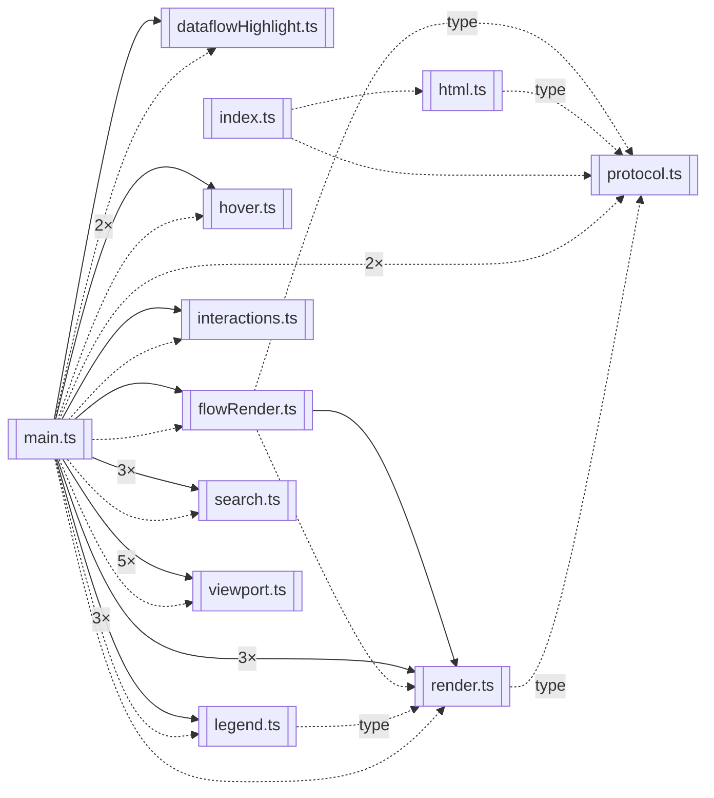
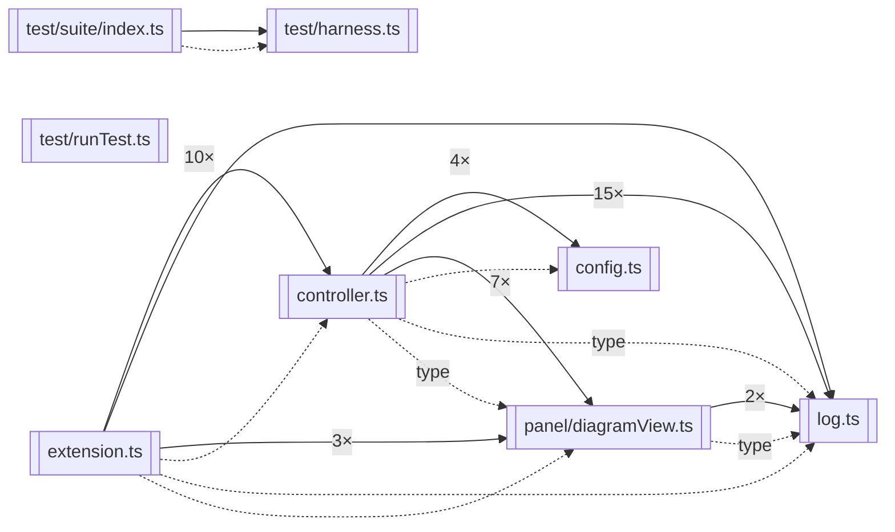

# Architecture

Slop is a pnpm monorepo with a strict dependency direction:

```
packages/core      pure analysis & export — no vscode, no DOM, no filesystem
packages/webview   diagram UI — imports pure helpers from core, no vscode
packages/extension VS Code host — the only package allowed to touch the editor
```

The pipeline every diagram flows through:

```
source text ─▶ adapter (TS compiler / tree-sitter) ─▶ Semantic Graph IR
           ─▶ transforms (collapse, slice, filter, expand) ─▶ layout (ELK)
           ─▶ webview renderer  |  exporters (mermaid, draw.io, SVG, JSON)
```

Key decisions, in the code where they're enforced:

- **The IR is the contract** ([ir-spec.md](./ir-spec.md), `core/src/ir/`):
  deterministic ids, structural validation, canonical ordering. Everything —
  renderer, exporters, transforms — consumes the same graph, so what you
  export is what you saw.
- **Adapters are honest** (`core/src/adapter.ts`): capability flags say what a
  language really provides (`callGraph: "typed"` for TS, `"heuristic"` for
  tree-sitter languages), and heuristic edges are marked low-confidence.
- **Layout is shared and bounded** (`core/src/layout/`): ELK layered, with a
  dense-graph fallback past 600 edges (found by the SBS-090 benchmarks).
- **The webview is sandboxed** (`extension/src/panel/`, `webview/src/`):
  strict CSP, nonce-only scripts, typed message protocol with a version
  handshake, pure string-rendered SVG.

The diagrams below are generated by the tool itself — regenerate with
`pnpm docs:diagrams` after structural changes; CI treats a stale diagram the
same as stale formatting.

## core — module map

```mermaid
flowchart LR
  module_adapter_ts[["adapter.ts"]]
  module_bench_compare_ts[["bench/compare.ts"]]
  module_bench_synthetic_ts[["bench/synthetic.ts"]]
  module_cfg_builder_ts[["cfg/builder.ts"]]
  module_cfg_dataflow_ts[["cfg/dataflow.ts"]]
  module_cfg_mermaid_ts[["cfg/mermaid.ts"]]
  module_cfg_queries_ts[["cfg/queries.ts"]]
  module_cfg_types_ts[["cfg/types.ts"]]
  module_cfg_validate_ts[["cfg/validate.ts"]]
  module_export_drawio_ts[["export/drawio.ts"]]
  module_export_exporter_ts[["export/exporter.ts"]]
  module_export_json_ts[["export/json.ts"]]
  module_export_mermaid_ts[["export/mermaid.ts"]]
  module_export_svg_ts[["export/svg.ts"]]
  module_graph_scc_ts[["graph/scc.ts"]]
  module_incremental_ts[["incremental.ts"]]
  module_index_ts[["index.ts"]]
  module_ir_ids_ts[["ir/ids.ts"]]
  module_ir_types_ts[["ir/types.ts"]]
  module_ir_validate_ts[["ir/validate.ts"]]
  module_layout_label_ts[["layout/label.ts"]]
  module_layout_layout_ts[["layout/layout.ts"]]
  module_python_adapter_ts[["python/adapter.ts"]]
  module_stable_json_ts[["stable-json.ts"]]
  module_transforms_glob_ts[["transforms/glob.ts"]]
  module_transforms_transforms_ts[["transforms/transforms.ts"]]
  module_treesitter_mapper_ts[["treesitter/mapper.ts"]]
  module_treesitter_runtime_ts[["treesitter/runtime.ts"]]
  module_typescript_adapter_ts[["typescript/adapter.ts"]]
  module_typescript_calls_ts[["typescript/calls.ts"]]
  module_typescript_common_ts[["typescript/common.ts"]]
  module_typescript_host_ts[["typescript/host.ts"]]
  module_typescript_imports_ts[["typescript/imports.ts"]]
  module_typescript_structure_ts[["typescript/structure.ts"]]
  module_cfg_builder_ts -->|"2×"| module_typescript_common_ts
  module_cfg_dataflow_ts -->|"3×"| module_typescript_common_ts
  module_export_drawio_ts --> module_export_exporter_ts
  module_export_json_ts --> module_stable_json_ts
  module_export_mermaid_ts -->|"2×"| module_layout_label_ts
  module_export_svg_ts --> module_export_exporter_ts
  module_incremental_ts --> module_ir_ids_ts
  module_incremental_ts --> module_stable_json_ts
  module_incremental_ts -->|"2×"| module_typescript_adapter_ts
  module_ir_validate_ts --> module_ir_ids_ts
  module_layout_layout_ts -->|"2×"| module_layout_label_ts
  module_python_adapter_ts --> module_treesitter_mapper_ts
  module_python_adapter_ts --> module_treesitter_runtime_ts
  module_transforms_transforms_ts -->|"5×"| module_ir_ids_ts
  module_transforms_transforms_ts -->|"2×"| module_transforms_glob_ts
  module_treesitter_mapper_ts --> module_adapter_ts
  module_treesitter_mapper_ts -->|"8×"| module_ir_ids_ts
  module_typescript_adapter_ts --> module_adapter_ts
  module_typescript_adapter_ts --> module_ir_ids_ts
  module_typescript_adapter_ts -.->|"?"| module_typescript_calls_ts
  module_typescript_adapter_ts --> module_typescript_common_ts
  module_typescript_adapter_ts --> module_typescript_host_ts
  module_typescript_adapter_ts -->|"2×"| module_typescript_imports_ts
  module_typescript_adapter_ts -->|"2×"| module_typescript_structure_ts
  module_typescript_calls_ts --> module_ir_ids_ts
  module_typescript_calls_ts -->|"10×"| module_typescript_common_ts
  module_typescript_calls_ts --> module_typescript_host_ts
  module_typescript_common_ts -->|"2×"| module_ir_ids_ts
  module_typescript_common_ts --> module_typescript_host_ts
  module_typescript_imports_ts --> module_graph_scc_ts
  module_typescript_imports_ts --> module_ir_ids_ts
  module_typescript_imports_ts -->|"2×"| module_typescript_common_ts
  module_typescript_imports_ts -->|"3×"| module_typescript_host_ts
  module_typescript_structure_ts -->|"3×"| module_ir_ids_ts
  module_typescript_structure_ts -->|"7×"| module_typescript_common_ts
  module_typescript_structure_ts --> module_typescript_host_ts
  module_adapter_ts -.->|"type"| module_ir_types_ts
  module_bench_synthetic_ts -.->|"type"| module_adapter_ts
  module_cfg_builder_ts -.->|"type"| module_adapter_ts
  module_cfg_builder_ts -.->|"type"| module_cfg_types_ts
  module_cfg_builder_ts -.->|"type"| module_ir_types_ts
  module_cfg_builder_ts -.-> module_typescript_common_ts
  module_cfg_dataflow_ts -.->|"type"| module_adapter_ts
  module_cfg_dataflow_ts -.->|"type"| module_ir_types_ts
  module_cfg_dataflow_ts -.-> module_typescript_common_ts
  module_cfg_mermaid_ts -.->|"type"| module_cfg_types_ts
  module_cfg_queries_ts -.->|"type"| module_cfg_types_ts
  module_cfg_types_ts -.->|"type"| module_ir_types_ts
  module_cfg_validate_ts -.->|"type"| module_cfg_types_ts
  module_export_drawio_ts -.-> module_export_exporter_ts
  module_export_drawio_ts -.->|"type"| module_ir_types_ts
  module_export_exporter_ts -.->|"type"| module_ir_types_ts
  module_export_exporter_ts -.->|"type"| module_layout_layout_ts
  module_export_json_ts -.->|"type"| module_export_exporter_ts
  module_export_json_ts -.-> module_stable_json_ts
  module_export_mermaid_ts -.->|"type"| module_export_exporter_ts
  module_export_mermaid_ts -.->|"type"| module_ir_types_ts
  module_export_mermaid_ts -.-> module_layout_label_ts
  module_export_svg_ts -.-> module_export_exporter_ts
  module_export_svg_ts -.->|"type"| module_ir_types_ts
  module_incremental_ts -.->|"type"| module_adapter_ts
  module_incremental_ts -.-> module_ir_ids_ts
  module_incremental_ts -.->|"2×"| module_ir_types_ts
  module_incremental_ts -.-> module_stable_json_ts
  module_incremental_ts -.-> module_typescript_adapter_ts
  module_index_ts -.-> module_adapter_ts
  module_index_ts -.-> module_cfg_builder_ts
  module_index_ts -.-> module_cfg_dataflow_ts
  module_index_ts -.-> module_cfg_mermaid_ts
  module_index_ts -.-> module_cfg_queries_ts
  module_index_ts -.->|"type"| module_cfg_types_ts
  module_index_ts -.-> module_cfg_validate_ts
  module_index_ts -.-> module_export_drawio_ts
  module_index_ts -.-> module_export_exporter_ts
  module_index_ts -.-> module_export_json_ts
  module_index_ts -.-> module_export_mermaid_ts
  module_index_ts -.-> module_export_svg_ts
  module_index_ts -.-> module_incremental_ts
  module_index_ts -.-> module_ir_ids_ts
  module_index_ts -.-> module_ir_types_ts
  module_index_ts -.-> module_ir_validate_ts
  module_index_ts -.-> module_layout_label_ts
  module_index_ts -.-> module_layout_layout_ts
  module_index_ts -.-> module_python_adapter_ts
  module_index_ts -.-> module_stable_json_ts
  module_index_ts -.-> module_transforms_transforms_ts
  module_index_ts -.-> module_treesitter_mapper_ts
  module_index_ts -.-> module_treesitter_runtime_ts
  module_index_ts -.-> module_typescript_adapter_ts
  module_ir_ids_ts -.->|"type"| module_ir_types_ts
  module_ir_validate_ts -.-> module_ir_ids_ts
  module_ir_validate_ts -.->|"type"| module_ir_types_ts
  module_layout_label_ts -.->|"type"| module_ir_types_ts
  module_layout_layout_ts -.->|"type"| module_ir_types_ts
  module_layout_layout_ts -.-> module_layout_label_ts
  module_python_adapter_ts -.->|"type"| module_adapter_ts
  module_python_adapter_ts -.->|"type"| module_ir_types_ts
  module_python_adapter_ts -.-> module_treesitter_mapper_ts
  module_python_adapter_ts -.-> module_treesitter_runtime_ts
  module_transforms_transforms_ts -.-> module_ir_ids_ts
  module_transforms_transforms_ts -.->|"type"| module_ir_types_ts
  module_transforms_transforms_ts -.-> module_transforms_glob_ts
  module_treesitter_mapper_ts -.->|"2×"| module_adapter_ts
  module_treesitter_mapper_ts -.-> module_ir_ids_ts
  module_treesitter_mapper_ts -.->|"type"| module_ir_types_ts
  module_treesitter_mapper_ts -.->|"type"| module_treesitter_runtime_ts
  module_typescript_adapter_ts -.-> module_adapter_ts
  module_typescript_adapter_ts -.-> module_ir_ids_ts
  module_typescript_adapter_ts -.->|"type"| module_ir_types_ts
  module_typescript_adapter_ts -.-> module_typescript_calls_ts
  module_typescript_adapter_ts -.-> module_typescript_common_ts
  module_typescript_adapter_ts -.-> module_typescript_host_ts
  module_typescript_adapter_ts -.-> module_typescript_imports_ts
  module_typescript_adapter_ts -.-> module_typescript_structure_ts
  module_typescript_calls_ts -.-> module_ir_ids_ts
  module_typescript_calls_ts -.-> module_typescript_common_ts
  module_typescript_calls_ts -.-> module_typescript_host_ts
  module_typescript_common_ts -.-> module_ir_ids_ts
  module_typescript_common_ts -.->|"type"| module_ir_types_ts
  module_typescript_common_ts -.-> module_typescript_host_ts
  module_typescript_host_ts -.->|"type"| module_adapter_ts
  module_typescript_imports_ts -.-> module_graph_scc_ts
  module_typescript_imports_ts -.-> module_ir_ids_ts
  module_typescript_imports_ts -.-> module_typescript_common_ts
  module_typescript_imports_ts -.-> module_typescript_host_ts
  module_typescript_structure_ts -.-> module_ir_ids_ts
  module_typescript_structure_ts -.->|"type"| module_ir_types_ts
  module_typescript_structure_ts -.-> module_typescript_common_ts
  module_typescript_structure_ts -.-> module_typescript_host_ts
```

<!-- diagram:core -->



<!-- /diagram:core -->

## webview — module map

<!-- diagram:webview -->



<!-- /diagram:webview -->

## extension — module map

<!-- diagram:extension -->



<!-- /diagram:extension -->
